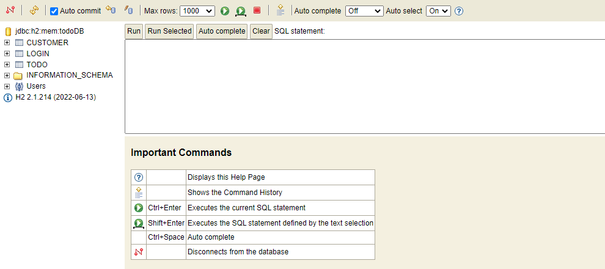
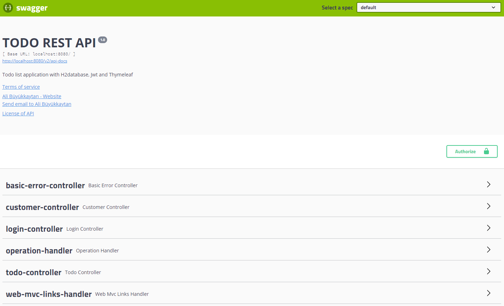
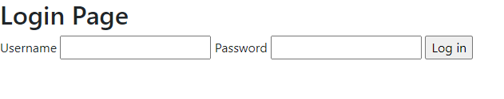

# ToDo App Project with Spring Boot
***


***
### Entities
- Customer, Todo, Login
***

### Controller
- CustomerController, TodoController, LoginController

***
### Services
- CustomerService, TodoService
- LoginService, UserDetailsImpl (for Jwt Authorization and Authentication)
***

Regiser :
```json
{
  "name": "abkode",
  "password": "123456",
  "email": "aasd@deneme.com",
  "phoneNumber": "555000"
}
```
Login :
```json
{
  "username": "abkode",
  "password": "123456"
}
```
* H2Database Screenshot:



* Swagger - Authorize Screenshot:


* Still working on thymeleaf
